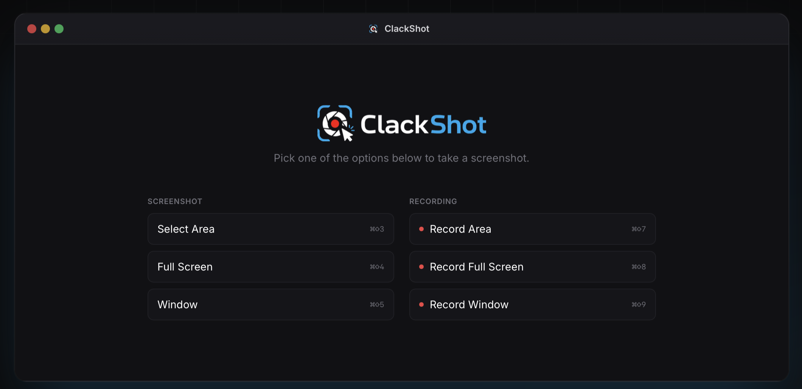
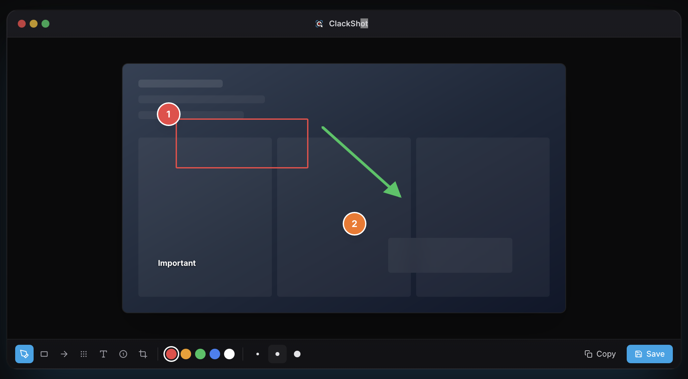

<div align="center">
  
  <p>Modern, minimal, cross-platform ekran görüntüsü ve ekran kaydı uygulaması.</p>

  [](https://github.com/mustafa-kartal/clackshot/releases/latest)
  [](./LICENSE)
  [](https://github.com/mustafa-kartal/clackshot/releases/latest)
  [](https://github.com/mustafa-kartal/clackshot/releases)

  [English](./README.md)
</div>

## Ekran Görüntüleri

<div align="center">
  
  
</div>

## Özellikler

- **Ekran görüntüsü** — tam ekran, belirli alan seçimi, pencere capture
- **Ekran kaydı** — MediaRecorder tabanlı, MP4 çıktı
- **Annotation editörü** — Konva tabanlı, metin, şekil, ok ekleme
- **Face cam** — kayıt sırasında kamera overlay
- **Clipboard** — capture sonrası otomatik panoya kopyalama
- **PNG kayıt** — istediğin konuma dışa aktar
- **Sistem tray** — arka planda çalışır, her zaman erişilebilir
- **Global kısayollar** — uygulamaya geçmeden tetikle
- **Otomatik güncelleme** — GitHub Releases üzerinden

## Kısayollar

| Eylem | macOS | Windows / Linux |
|---|---|---|
| Tam ekran capture | `Cmd+Shift+3` | `Ctrl+Shift+3` |
| Alan seçerek capture | `Cmd+Shift+4` | `Ctrl+Shift+4` |
| Ekran kaydı başlat/durdur | `Cmd+Shift+5` | `Ctrl+Shift+5` |

## Geliştirme

```bash
npm install
npm run dev
```

> **macOS:** İlk açılışta System Settings → Privacy & Security → **Screen Recording** altında uygulamaya izin verin.

## Build

```bash
npm run build:mac     # macOS (dmg + zip, x64 + arm64)
npm run build:win     # Windows (nsis x64)
npm run build:linux   # Linux (AppImage + deb)
```

> macOS notarization için `APPLE_ID` ve `APPLE_APP_SPECIFIC_PASSWORD` env değişkenlerini ayarlayın, `electron-builder.yml` içinde `notarize: true` yapın.

## Mimari

```
electron/
  main/         # Ana süreç (Node) — IPC, tray, shortcuts, updater
  preload/      # Renderer'a güvenli köprü
src/
  editor/       # Ana editör penceresi (React + Tailwind + Konva)
  overlay/      # Saydam fullscreen capture alanı
  face-cam/     # Kamera overlay penceresi
  splash/       # Başlangıç ekranı
  shared/       # Ortak tipler (main + renderer)
```

## Changelog

Tüm sürüm notları için [CHANGELOG.md](CHANGELOG.md) dosyasına bakın.

## Katkı

Pull request'ler memnuniyetle karşılanır. Büyük değişiklikler için önce bir [issue açın](https://github.com/mustafa-kartal/clackshot/issues).

## Lisans

[MIT](LICENSE)
